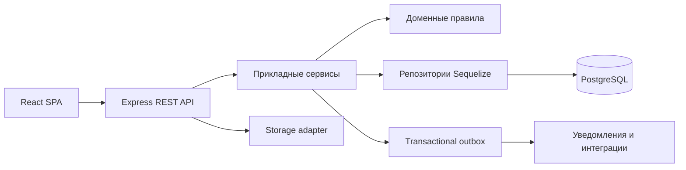

# Архитектура

## Стиль

Система строится как modular monolith. Это сохраняет простоту единого
развёртывания и транзакций PostgreSQL, но задаёт границы, позволяющие позже
выделять модули.



## Технологический стек

- frontend: React, Vite, React Router, Axios, JavaScript ES2022+, React Hook
  Form, Zod, Zustand, TanStack Query, CSS Modules;
- backend: Node.js, Express, JavaScript ES2022+, Sequelize, PostgreSQL, Zod,
  Multer, Pino;
- безопасность: JWT access token, ротационный refresh token в HttpOnly cookie,
  Argon2;
- контракт: REST `/api/v1`, OpenAPI 3;
- тесты: Vitest или Jest, Supertest, Playwright;
- эксплуатация: Docker Compose, Nginx, health/readiness, JSON-логи;
- качество: ESLint и Prettier.

Точные версии зависимостей выбираются и фиксируются на этапе 2 после проверки
их актуальной совместимости.

## Слои backend-модуля

- `routes` — URL, middleware и привязка обработчика;
- `controller` — преобразование HTTP-запроса и ответа;
- `service` — вариант использования, транзакция и оркестрация;
- `domain` — расчёты, инварианты и машины состояний;
- `repository` — tenant-scoped обращения к Sequelize;
- `validation` — входные схемы;
- `permissions` — разрешения модуля;
- `errors` — стабильные коды доменных ошибок.

Контроллер не содержит бизнес-логики, а модель Sequelize не принимает
бизнес-решения.

## Модули

`auth`, `organizations`, `branches`, `users`, `roles`, `clients`, `catalog`,
`price-lists`, `orders`, `production`, `payments`, `cash`, `files`,
`notifications`, `reports`, `audit`, `settings`.

Модуль экспортирует только публичный API. Прямой импорт внутренних repositories
или models другого модуля запрещён.

## Tenant isolation

- `organizationId` определяется из проверенной сессии, не из тела или query;
- пользователь MVP принадлежит ровно одной организации;
- доступные филиалы извлекаются из назначений пользователя;
- repositories требуют tenant context;
- связанные tenant-сущности проверяются на одинаковый `organizationId`;
- отчёты, экспорт и файлы используют те же ограничения;
- superadmin работает через отдельный явно выбранный платформенный контекст;
- изоляция покрывается негативными integration-тестами.

## Конкурентный доступ

- деньги хранятся целыми минимальными единицами в `BIGINT`;
- платежи, возвраты и выдачи требуют `Idempotency-Key`;
- критические операции используют транзакцию и `SELECT ... FOR UPDATE`;
- заказы и производственные сущности используют optimistic locking;
- последовательность номера блокируется атомарно;
- outbox-событие записывается в транзакции бизнес-операции;
- на повторный запрос возвращается сохранённый результат, а не новая операция.

## Файлы

MVP использует локальное хранилище через интерфейс `FileStorage`. Метаданные
находятся в PostgreSQL. Скачивание выполняется только через авторизованный API
или короткоживущую подписанную ссылку. Это позволяет заменить локальное
хранилище на S3-совместимое без изменения модуля заказов.

## Структура репозитория

```text
root/
  client/
    src/{app,api,pages,layouts,modules,components,hooks,store,styles,tests}
  server/
    src/
      {app.js,server.js}
      config/
      database/{models,migrations,seeders}
      modules/
      middlewares/
      shared/
      tests/
  docs/
  docker/
  docker-compose.yml
  .env.example
  .gitignore
  README.md
```

## Стандарт ответа API

Успех:

```json
{ "data": {}, "meta": { "correlationId": "uuid" }, "error": null }
```

Ошибка:

```json
{
  "data": null,
  "meta": { "correlationId": "uuid" },
  "error": { "code": "ORDER_NOT_FOUND", "message": "Заказ не найден", "details": [] }
}
```

В production stack trace клиенту не возвращается.
