# Предварительная модель данных

## ER-диаграмма

```mermaid
erDiagram
    ORGANIZATION ||--|| ORGANIZATION_SETTINGS : has
    ORGANIZATION ||--o{ BRANCH : owns
    BRANCH ||--o{ LOCATION : contains
    LOCATION ||--o{ WORKPLACE : contains
    ORGANIZATION ||--o{ USER : employs
    USER ||--o{ USER_BRANCH : accesses
    BRANCH ||--o{ USER_BRANCH : permits
    USER ||--o{ USER_ROLE : receives
    ROLE ||--o{ USER_ROLE : assigned
    ROLE ||--o{ ROLE_PERMISSION : contains
    PERMISSION ||--o{ ROLE_PERMISSION : grants
    USER ||--o{ REFRESH_SESSION : opens

    ORGANIZATION ||--o{ CLIENT : owns
    CLIENT ||--o{ CLIENT_ADDRESS : has
    CLIENT ||--o{ CLIENT_CONSENT : grants

    ORGANIZATION ||--o{ SERVICE : offers
    SERVICE_CATEGORY ||--o{ SERVICE : groups
    ORGANIZATION ||--o{ PRICE_LIST : owns
    PRICE_LIST ||--o{ PRICE_LIST_ITEM : contains
    SERVICE ||--o{ PRICE_LIST_ITEM : priced

    ORGANIZATION ||--o{ ORDER : owns
    BRANCH ||--o{ ORDER : accepts
    CLIENT ||--o{ ORDER : places
    ORDER ||--|{ ORDER_ITEM : contains
    ORDER ||--o{ ORDER_ISSUE : has
    ORDER_ISSUE ||--|{ ORDER_ISSUE_ITEM : includes
    ORDER_ITEM ||--o{ ORDER_ISSUE_ITEM : issued_by

    GARMENT_TYPE ||--o{ ORDER_ITEM : classifies
    MATERIAL ||--o{ ORDER_ITEM : describes
    COLOR ||--o{ ORDER_ITEM : describes
    ORDER_ITEM ||--o{ ORDER_ITEM_SERVICE : receives
    SERVICE ||--o{ ORDER_ITEM_SERVICE : snapshots
    ORDER_ITEM ||--o{ ORDER_ITEM_DEFECT : has
    DEFECT ||--o{ ORDER_ITEM_DEFECT : classifies
    ORDER_ITEM ||--o{ ORDER_ITEM_CONTAMINATION : has
    CONTAMINATION ||--o{ ORDER_ITEM_CONTAMINATION : classifies

    PRODUCTION_ROUTE ||--o{ PRODUCTION_ROUTE_STAGE : defines
    PRODUCTION_STAGE ||--o{ PRODUCTION_ROUTE_STAGE : orders
    PRODUCTION_ROUTE ||--o{ ORDER_ITEM : routes
    ORDER_ITEM ||--o{ ITEM_STAGE_HISTORY : records
    ORDER_ITEM ||--o{ ITEM_MOVEMENT : moves

    ORDER ||--o{ PAYMENT : receives
    PAYMENT ||--o{ REFUND : reverses
    CASH_SHIFT ||--o{ CASH_TRANSACTION : contains
    PAYMENT ||--o{ CASH_TRANSACTION : posts

    ORDER_ITEM ||--o{ FILE : documents
    CLIENT ||--o{ NOTIFICATION : receives
    ORGANIZATION ||--o{ AUDIT_LOG : records
    ORGANIZATION ||--o{ OUTBOX_EVENT : publishes
    ORGANIZATION ||--o{ IDEMPOTENCY_KEY : scopes
```

## Общие правила

- первичные ключи — UUID;
- денежные поля — `BIGINT` в минимальных единицах;
- даты событий — `TIMESTAMPTZ`, бизнес-дата приёма — `DATE`;
- tenant-сущности имеют обязательный `organizationId`;
- изменяемые агрегаты имеют `version`;
- timestamps обязательны;
- справочники архивируются через `archivedAt`;
- финансовые операции, аудит, история статусов и выдачи не удаляются;
- миграции являются единственным production-способом изменения схемы;
- `Sequelize.sync()` в production запрещён.

## Критические ограничения

- `Branch.code`: unique `(organizationId, code)`;
- `Order.number`: unique `(organizationId, acceptanceLocationId, sequence)`;
- `Order.displayNumber`: unique `(organizationId, displayNumber)`;
- `OrderItem.scanCode`: global unique, не содержит персональных данных;
- `PriceListItem`: unique `(priceListId, serviceId, garmentTypeId)`;
- `Payment.idempotencyKey`: unique `(organizationId, idempotencyKey)`;
- `Refund.idempotencyKey`: unique `(organizationId, idempotencyKey)`;
- `OrderIssue.idempotencyKey`: unique `(organizationId, idempotencyKey)`;
- `OrderIssueItem.orderItemId`: unique, предотвращает двойную выдачу;
- сумма успешных возвратов не может превысить сумму исходной оплаты;
- сумма подтверждённых оплат минус возвраты определяет `paidAmount`;
- `OrderItemService` хранит snapshot названия, ставки, количества и итоговой
  цены, поэтому изменение прайса не меняет старый заказ.

## Сущности, добавленные к исходному перечню

- `UserBranch` — явный доступ пользователя к нескольким филиалам;
- `NumberSequence` — атомарные последовательности точек приёма;
- `OrderIssue` и `OrderIssueItem` — доказуемая, идемпотентная частичная выдача;
- `OrderStatusHistory` — история переходов заказа.

Эти сущности необходимы для подтверждённых требований и не являются
преждевременным расширением.
