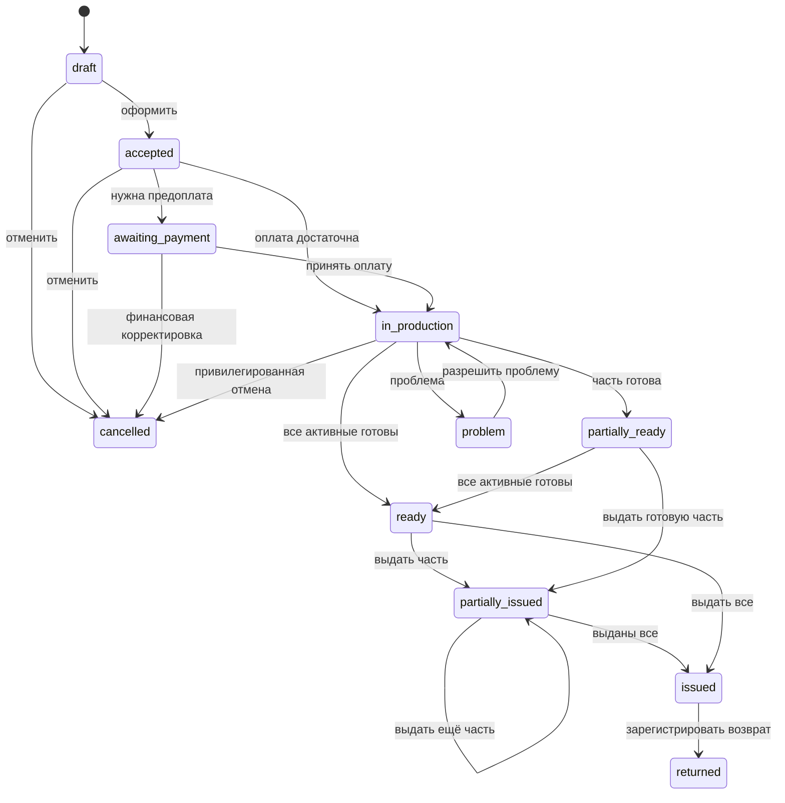
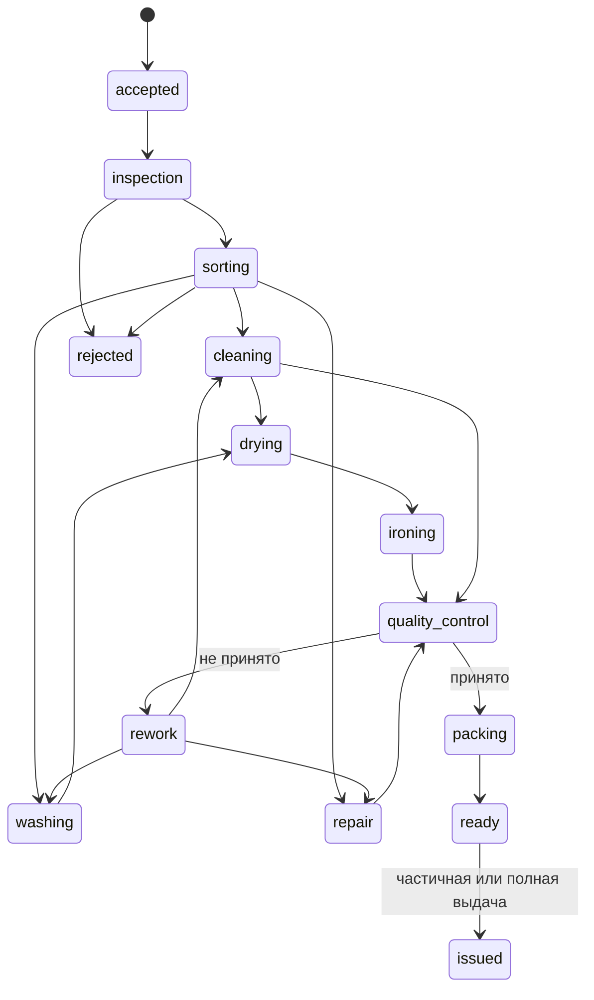

# Жизненные циклы

## Заказ

Статусы `partially_ready`, `ready`, `partially_issued` и `issued` рассчитываются
из активных изделий и записей выдачи. Прямое обновление поля статуса запрещено.

## Изделие

Диаграмма показывает стандартный seed-маршрут. Реально разрешённые переходы
задаются `ProductionRouteStage`, но системные терминальные инварианты остаются
в коде.

## Контракт перехода

Каждый переход через `orderStatusService.transition` или
`itemWorkflowService.transition` определяет:

- исходный и целевой статус;
- permission;
- допустимый маршрут;
- предусловия и блокирующие ограничения;
- побочные действия;
- outbox-событие;
- запись истории и аудита;
- стабильные коды ошибок.

## Правила частичной выдачи

1. Выбираются изделия одного заказа со статусом `ready`.
2. Проверяются организация, филиал пользователя и `orders.issue`.
3. Проверяется достаточность оплаты; долг требует отдельного
   `orders.issue_with_debt`.
4. Заказ и изделия блокируются в транзакции.
5. Проверяется отсутствие предыдущей выдачи каждого изделия.
6. Создаются `OrderIssue` и `OrderIssueItem`.
7. Изделия становятся `issued`.
8. Агрегат заказа становится `partially_issued` или `issued`.
9. Создаются аудит и outbox-событие.
10. Повтор с тем же ключом идемпотентности возвращает первый результат.
